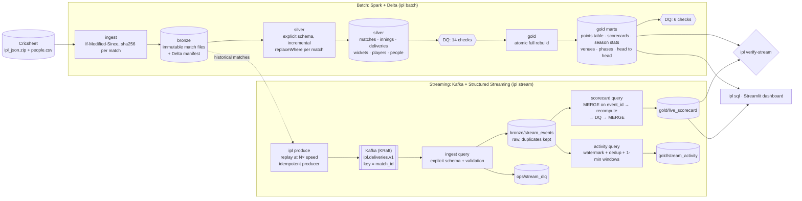

# IPL streaming lakehouse

[](https://github.com/rohit91jacob/ipl-streaming-lakehouse/actions/workflows/ci.yml)
[](https://github.com/rohit91jacob/ipl-streaming-lakehouse/actions/workflows/refresh.yml)
[](https://rohit91jacob.github.io/ipl-streaming-lakehouse/)
[](LICENSE)
[](DATA_LICENSE.md)


An end-to-end data engineering project on Indian Premier League ball-by-ball data. It covers
every IPL match since 2008: about 1,250 matches and about 300,000 deliveries from
[Cricsheet](https://cricsheet.org/).

* **Batch.** An incremental, idempotent medallion pipeline: Cricsheet → immutable bronze →
  conformed silver → gold marts. It runs on Spark 4.1 and Delta Lake 4.4, with data-quality gates
  between layers. The gold layer has scorecards, season stats, venue, phase and head-to-head
  marts, and a points table whose net run rate matches the published tables. That covers DLS,
  bowled-out sides, super overs, washouts and voided fixtures.
* **Streaming.** A replay producer turns historical matches into a live Kafka feed. A Spark
  Structured Streaming job turns that feed into a **live scorecard** (runs, wickets, overs, run
  rate, target, required rate). It is effectively-once over an at-least-once transport, with a
  dead-letter queue, streaming DQ checks and a watermarked activity metric.
* **Proof.** Across 19 seasons, the points tables match the published standings for 165 of 166
  team-seasons. The one exception is a sign typo on Wikipedia; see
  [verification](docs/verification.md). Kohli's 973 runs in 2016 come out exactly. The streaming
  scorecard of the 2025 final reconciles with the batch scorecard, even after a SIGKILL mid-match
  and a full duplicate replay.
* **Live results.** A scheduled GitHub Actions job refreshes the lake from Cricsheet every
  day and publishes **[rohit91jacob.github.io/ipl-streaming-lakehouse](https://rohit91jacob.github.io/ipl-streaming-lakehouse/)**:
  the latest points table with NRR, Orange and Purple Cap top 10, recent results, all-time
  leaders and champions, plus a page per season. No credentials are involved.

## Architecture



| Component | Code | What it does |
|---|---|---|
| Ingest | `ingest/cricsheet.py`, `ingest/manifest.py` | Conditional download with retries, then lands each match content-addressed (`match_id=<id>/<sha256>.json`). One manifest commit per run lists every new or changed version. Invalid files are quarantined. No JVM. |
| Silver | `batch/silver.py`, `batch/schemas.py` | Parses Cricsheet JSON with a declared Spark schema and derives ball-level facts (legal balls, phases, official powerplays, labels, cumulative score). Replaces only changed matches, atomically per table. |
| Gold | `batch/gold.py` | Ten marts rebuilt and swapped atomically. ICC/IPL NRR rules are in `cricket.py` and pinned by tests. |
| Data quality | `quality/checks.py` | Each check returns violating rows. Results go to `ops/dq_results`; failed `error` checks stop the run (exit code 3). |
| Producer | `streaming/producer.py`, `streaming/events.py` | A versioned JSON envelope with a deterministic `event_id`, keyed by `match_id`. Has a speed-up factor, plus `--limit` and `--duplicate-every` for drills. |
| Stream processor | `streaming/processor.py` | Three checkpointed queries (ingest, scorecard, activity). See [streaming semantics](docs/streaming.md). |
| Serving | `query.py`, `dashboard/app.py` | `ipl sql` runs SQL on the Delta tables with delta-rs/DataFusion (no JVM, about 1 s). Optional Streamlit dashboard. |
| Reference data | `reference/*.csv` | Team → franchise, 60 venue spellings → canonical venue, and the matches Cricsheet cannot have (abandoned without a ball, voided). |

## Tech stack

All versions are pinned in `uv.lock` and the Dockerfile and tested together.

| Layer | Technology | Version |
|---|---|---|
| Language | Python | 3.12 |
| Processing | Apache Spark (PySpark), local mode or any cluster manager | 4.1.3 |
| Table format | Delta Lake `delta-spark` (`io.delta:delta-spark_4.1_2.13`) | 4.4.1 |
| Kafka source | `org.apache.spark:spark-sql-kafka-0-10_2.13` | 4.1.3 |
| Streaming platform | Apache Kafka, KRaft mode (`apache/kafka` image) | 4.3.1 |
| Kafka client | confluent-kafka (librdkafka) | 2.16.0 |
| Lightweight Delta access | deltalake (delta-rs) + DataFusion | 1.6.6 |
| JVM | OpenJDK / Temurin | 21 |
| Packaging | uv, hatchling | uv 0.12.23 |
| Dashboard (optional) | Streamlit | 1.65.0 |
| Kafka UI (optional) | kafbat/kafka-ui | v1.5.0 |
| Quality tooling | pytest 9.1, ruff 0.16, pre-commit, gitleaks, Dependabot | |

## Data source

| | |
|---|---|
| Source | Cricsheet IPL archive, <https://cricsheet.org/downloads/ipl_json.zip> (JSON format 1.2.0) and the people register <https://cricsheet.org/register/people.csv> |
| Coverage (7 Oct 2026) | 1,243 matches, 2008 – 2026; 295,732 deliveries; 14,705 wickets |
| Licence | [ODC Attribution License 1.0](https://opendatacommons.org/licenses/by/1-0/). If you publish derived data, credit Cricsheet; see [DATA_LICENSE.md](DATA_LICENSE.md). The full dataset is downloaded at runtime and never committed. The repository holds only six real match files used as test fixtures. |
| Refresh | Cricsheet adds IPL matches during the season, typically within a day or two of play. Run `ipl batch` daily in season. Unchanged archives cost one HTTP 304. |
| Known gaps | Cricsheet only has matches with ball-by-ball data. Twelve league matches abandoned without a ball being bowled are missing from it, although each team got a point. They are supplied, with sources, in `reference/match_adjustments.csv`, along with the voided 2025 Dharamsala match. |

## Data model

| Layer | Tables (grain) |
|---|---|
| Bronze | match files (one per version), `bronze_manifest` (match × version), people register, `stream_events` (Kafka message) |
| Silver | `matches` (match), `innings` (match × innings), `deliveries` (ball), `wickets` (dismissal), `match_players`, `substitutions`, `people`, `stream_deliveries` (distinct live delivery), `stream_matches` |
| Gold | `innings_summary`, `match_summary`, `batting_scorecard`, `bowling_scorecard`, `player_season_batting`, `player_season_bowling`, `points_table`, `venue_stats`, `team_phase_stats`, `head_to_head`, `live_scorecard`, `stream_activity` |
| Ops | `dq_results`, `stream_dlq` |

Columns, keys and definitions (legal ball, official balls, all out, NRR, …) are in the
**[data dictionary](docs/data_dictionary.md)**.

## Quickstart

### Prerequisites

* Python 3.12 and [uv](https://docs.astral.sh/uv/)
* Java 17 or 21 (`java -version`)
* About 3 GB of free RAM and internet access to Cricsheet and Maven Central (the first Spark run
  downloads the Delta and Kafka jars, about 30 MB)
* For streaming: a Kafka broker. `docker compose up -d kafka kafka-init` provides one on
  `localhost:9094`; any Kafka ≥ 3.x works.

### Batch: build the lakehouse

```bash
git clone https://github.com/rohit91jacob/ipl-streaming-lakehouse.git
cd ipl-streaming-lakehouse
uv sync --all-extras
uv run ipl batch          # download -> bronze -> silver -> DQ -> gold -> DQ
```

A clean run took 8 min 49 s on a shared 12-core laptop. It landed 1,243 matches, and all 20 DQ
checks passed. Run it again and it only rebuilds gold. Then query the results with no JVM:

```console
$ uv run ipl sql "SELECT position, team, played, won, lost, no_result, points, net_run_rate FROM points_table WHERE season = 2016 ORDER BY position"
position  team                         played  won  lost  no_result  points  net_run_rate
--------  ---------------------------  ------  ---  ----  ---------  ------  ------------
1         Gujarat Lions                14      9    5     0          18      -0.374
2         Royal Challengers Bangalore  14      8    6     0          16      0.932
3         Sunrisers Hyderabad          14      8    6     0          16      0.245
4         Kolkata Knight Riders        14      8    6     0          16      0.106
5         Mumbai Indians               14      7    7     0          14      -0.146
6         Delhi Daredevils             14      7    7     0          14      -0.155
7         Rising Pune Supergiants      14      5    9     0          10      0.015
8         Kings XI Punjab              14      4    10    0          8       -0.646
```

`uv run ipl sql --list` shows every queryable table.

### Streaming: replay a match into a live scorecard

With a broker reachable at `IPL_KAFKA_BOOTSTRAP_SERVERS` (default `localhost:9092`):

```bash
uv run ipl topics                                                    # create ipl.deliveries.v1
uv run ipl produce --match-id 1473511 --speedup 0 --duplicate-every 25   # 2025 final, with duplicates
uv run ipl stream --available-now                                    # drain the topic, then exit
uv run ipl verify-stream --match-id 1473511                          # reconcile with the source
```

```console
innings_number  batting_team                 score_text    run_rate  target_runs  match_status  last_ball
--------------  ---------------------------  ------------  --------  -----------  ------------  ---------
1               Royal Challengers Bengaluru  190/9 (20.0)  9.5                    completed     19.6
2               Punjab Kings                 184/7 (20.0)  9.2       191          completed     19.6
OK: live_scorecard for match 1473511 matches the source view (2 innings)
```

To watch it live instead, run `uv run ipl stream` (continuous, 5 s triggers) in one terminal and
`uv run ipl produce --match-id 1473511 --speedup 60` in another. The dashboard
(`uv run ipl dashboard`, port 8501) refreshes the live tab every 5 seconds.

### Docker Compose

> **Verified in CI only.** The commands below run in the `docker` job of every CI build. They
> have not been run on the author's machine, which has no Docker.

```bash
docker compose up -d --build                    # kafka (KRaft) + topic init + stream processor
docker compose run --rm batch                   # backfill the lakehouse into the shared volume
docker compose run --rm producer                # replay season ${IPL_REPLAY_SEASON:-2025}
docker compose run --rm stream verify-stream --match-id 1473511 --against gold
docker compose --profile ui --profile dashboard up -d   # kafka-ui :8080, dashboard :8501
docker compose down                              # add -v to drop the volumes
```

The image bakes the Spark jars in (`IPL_SPARK_JARS_DIR`), so containers never contact Maven. It
runs as a non-root user with `tini` as PID 1, so a `SIGTERM` stops the queries cleanly.

## Configuration

Every setting is an environment variable with a safe default. Copy
[`.env.example`](.env.example) to `.env`; the Makefile and compose both read it. Invalid values
fail fast with exit code 2.

| Variable | Default | Purpose |
|---|---|---|
| `IPL_DATA_DIR` | `data` | Lakehouse root (`/data` in containers) |
| `IPL_CHECKPOINT_DIR` | `$IPL_DATA_DIR/_checkpoints` | Structured Streaming checkpoints |
| `IPL_CRICSHEET_URL` / `IPL_CRICSHEET_REGISTER_URL` | Cricsheet URLs | Sources |
| `IPL_HTTP_TIMEOUT_SECONDS` / `IPL_HTTP_RETRIES` / `IPL_HTTP_USER_AGENT` | `60` / `5` / project UA | Download behaviour (exponential backoff, honours `Retry-After`) |
| `IPL_SPARK_MASTER` | `local[*]` | Spark master |
| `IPL_SPARK_DRIVER_MEMORY` | `2g` | Driver heap |
| `IPL_SPARK_SHUFFLE_PARTITIONS` | `8` | Shuffle and Delta log-replay parallelism |
| `IPL_SPARK_UI_ENABLED` / `IPL_SPARK_LOG_LEVEL` | `false` / `WARN` | Spark UI and JVM log level |
| `IPL_SPARK_JARS_DIR` | unset | Use pre-fetched jars instead of Maven (set in the image) |
| `IPL_KAFKA_BOOTSTRAP_SERVERS` | `localhost:9092` | Brokers |
| `IPL_KAFKA_TOPIC` | `ipl.deliveries.v1` | Topic |
| `IPL_KAFKA_TOPIC_PARTITIONS` / `IPL_KAFKA_REPLICATION_FACTOR` / `IPL_KAFKA_TOPIC_RETENTION_MS` | `6` / `1` / 7 days | Used by `ipl topics` |
| `IPL_KAFKA_SECURITY_PROTOCOL` | `PLAINTEXT` | `PLAINTEXT`, `SSL`, `SASL_PLAINTEXT`, `SASL_SSL` |
| `IPL_KAFKA_SASL_MECHANISM` / `_USERNAME` / `_PASSWORD` | unset | SASL (PLAIN, SCRAM-SHA-256/512) for both the producer and Spark |
| `IPL_KAFKA_STARTING_OFFSETS` | `earliest` | Only for a brand-new checkpoint |
| `IPL_KAFKA_MAX_OFFSETS_PER_TRIGGER` | `10000` | Back-pressure per micro-batch |
| `IPL_KAFKA_FAIL_ON_DATA_LOSS` | `true` | Fail if offsets the checkpoint expects have expired |
| `IPL_STREAM_TRIGGER_SECONDS` | `5` | Micro-batch interval |
| `IPL_STREAM_WATERMARK` / `IPL_STREAM_ACTIVITY_WINDOW` | `2 minutes` / `1 minute` | Activity query only |
| `IPL_STREAM_DQ_FAIL_ON_ERROR` | `true` | Stop the stream on a DQ violation |
| `IPL_REPLAY_SPEEDUP` | `60` | Replay clock compression (`0` = no sleeping) |
| `IPL_REPLAY_SECONDS_PER_BALL` / `IPL_REPLAY_INNINGS_BREAK_SECONDS` | `35` / `1200` | Simulated match clock |
| `IPL_DQ_FAIL_ON_ERROR` | `true` | Stop batch runs on DQ errors |
| `IPL_LOG_LEVEL` / `IPL_LOG_FORMAT` | `INFO` / `json` | Structured logs on stderr (`text` for humans) |

## CLI

```
ipl ingest [--force] [--archive ZIP] [--no-register]   ipl topics
ipl silver [--full-refresh]                             ipl produce (--match-id ID… | --season Y | --file F…) [--speedup X] [--limit N] [--duplicate-every N]
ipl gold                                                ipl stream [--available-now] [--queries ingest,scorecard,activity]
ipl dq [--layer silver|gold|all]                        ipl verify-stream --match-id ID [--against source|gold]
ipl batch [--full-refresh] [--skip-ingest] [--archive ZIP] [--no-register]
ipl sql "SELECT …" | --list                             ipl dashboard [--port 8501]
ipl report [--out site]                                 ipl stream-reset [--yes]
```

`ipl report` writes the static results site (plain HTML and CSS, no JavaScript or external
assets) from the gold tables through delta-rs, so it needs no JVM.

Exit codes: `0` ok · `1` failure · `2` usage or configuration · `3` data-quality failure · `4`
reconciliation mismatch. `make help` lists convenience targets that wrap these commands.

## Testing and CI

```bash
uv run pytest tests/unit                  # 81 tests, under a minute, no JVM
uv run pytest tests/spark                 # 22 Spark/Delta tests on six real matches (needs Java)
IPL_KAFKA_BOOTSTRAP_SERVERS=localhost:9092 uv run pytest -m integration tests/integration
```

The fixtures are real Cricsheet files picked for their edge cases: the 2025 final (impact
players), a tie decided by **two** super overs, the 2023 final chased under DLS on a reserve day,
a washed-out 5-over no result, a side "all out" for 9 with a player absent hurt, and the voided
2025 match. The tests check that:

* the pure-Python and Spark implementations of the cricket rules (phases, overs notation, NRR
  credits) agree;
* silver reconciles to the source files ball by ball, and an incremental re-ingest touches only
  the corrected match;
* the gold scorecards match the real ones (Kohli 43 off 35, Krunal Pandya 2/17), as do the
  points-table rules (bowled-out quota, DLS, super over, void, washouts);
* every DQ check passes on real data and fails on corrupted data;
* streaming survives duplicates, every DLQ reason, restarts and full replays, and a 7th legal
  ball in an over stops the query;
* a real Kafka broker round trip is effectively-once.

Three workflows run in GitHub Actions. All actions are pinned by SHA.

| Workflow | Trigger | What it does |
|---|---|---|
| [`ci.yml`](.github/workflows/ci.yml) | every push and PR | The jobs below |
| [`refresh.yml`](.github/workflows/refresh.yml) | Daily 05:00 UTC, or **Run workflow** | Restores the cached lake, runs `ipl batch` against live Cricsheet (data-quality gates fail the run), saves the lake, builds the site with `ipl report` and deploys it to GitHub Pages. A failed scheduled run opens or updates a `Scheduled refresh is failing` issue. |
| [`keepalive.yml`](.github/workflows/keepalive.yml) | 1st and 15th of each month | Re-enables the scheduled workflows through the API so GitHub's 60-day inactivity rule never switches them off. It makes no commits. |

`ci.yml` jobs:

| Job | What it does |
|---|---|
| `lint` | `uv lock --check`, `ruff check`, `ruff format --check`, gitleaks over the full git history |
| `unit` | Unit tests without a JVM |
| `spark` | Unit + Spark tests on Temurin 21 with coverage; the Ivy cache keeps jar downloads warm |
| `integration` | Kafka 4.3.1 service container, then producer → Kafka → Structured Streaming → Delta, including DLQ and replay |
| `docker` | Builds the image, validates compose, then runs a smoke test on the real stack: Kafka up, batch on the fixtures, replay the 2025 final with duplicates, `stream --available-now`, and `verify-stream` against both gold and the source file |

Dependabot (uv, actions, Docker, compose) and pre-commit (ruff, gitleaks, hygiene hooks) keep
the repository current and clean.

## Operations

* **Scheduling and freshness.** `refresh.yml` runs `ipl batch` on GitHub Actions daily at
  05:00 UTC and republishes the results site. On days with no new matches the download is a
  "not modified" no-op. The site header shows the date of the latest
  match in the data and when it was generated; `summary.json` has the same metadata for
  monitoring. Elsewhere, run `ipl batch` from cron, Airflow, Dagster or a k8s CronJob (the exit
  code is the contract). `ipl stream` is a long-running service; compose restarts it
  automatically.
* **Credentials.** None. Cricsheet is public, and the workflows use only the built-in,
  per-run `GITHUB_TOKEN` with minimal `permissions:` (Pages, issues, re-enabling workflows), so
  there are no secrets to rotate and nothing expires.
* **Backfill and reprocessing.** Bronze is immutable and versioned, so it is always safe to run
  `ipl silver --full-refresh && ipl gold`. Corrected Cricsheet files are picked up automatically
  as new versions.
* **Monitoring.** Logs are structured JSON. Streaming emits one progress line per micro-batch
  with throughput, latency, watermark and state size. `ops/dq_results`, `ops/stream_dlq` and
  `gold/stream_activity` back the dashboard's *Pipeline health* tab.
* **Runbook.** [docs/runbook.md](docs/runbook.md) covers backfills, DQ failures, DLQ triage,
  streaming DQ stops, checkpoint resets, Kafka retention gaps, and failed scheduled refreshes.

## Project structure

```
├── src/ipl_lakehouse/
│   ├── cli.py                  # `ipl` entrypoint
│   ├── config.py               # Settings.from_env() + lake layout
│   ├── cricket.py              # pure cricket rules: phases, overs, NRR credits
│   ├── cricsheet.py            # pure-Python reader for Cricsheet JSON
│   ├── spark.py                # SparkSession factory (Delta, Kafka, jar baking)
│   ├── query.py                # `ipl sql` via delta-rs/DataFusion
│   ├── report.py               # `ipl report`: static results site (GitHub Pages)
│   ├── logs.py                 # JSON logging
│   ├── ingest/                 # download, content-addressed landing, manifest
│   ├── batch/                  # schemas, silver, gold, Delta write helpers, pipeline
│   ├── quality/                # declarative DQ checks
│   ├── streaming/              # events, producer, kafka admin, processor, verify
│   ├── reference/              # teams.csv, venues.csv, match_adjustments.csv
│   └── dashboard/app.py        # Streamlit (optional extra)
├── tests/
│   ├── unit/                   # no JVM
│   ├── spark/                  # Spark + Delta on real fixtures
│   ├── integration/            # real Kafka
│   └── fixtures/cricsheet/     # six real Cricsheet matches (ODC-By) + LICENSE.txt
├── docs/                       # data dictionary, streaming semantics, runbook, verification
├── docker/Dockerfile           # one image, every role
├── docker-compose.yml          # kafka, kafka-init, stream, producer, batch, dashboard, kafka-ui
├── .github/                    # ci, refresh (schedule + Pages) and keepalive workflows; Dependabot
├── Makefile · .env.example · .pre-commit-config.yaml · pyproject.toml · uv.lock
└── LICENSE (MIT, code) · DATA_LICENSE.md (Cricsheet, ODC-By)
```

## Design rationale

A few constraints shaped the design. The data is real and public (Cricsheet's full IPL archive,
ODC-By), and correctness is judged against the published points tables, not only against
itself. Everything has to run on one laptop and on free GitHub-hosted runners, with no cloud
account and no credentials: Spark in local mode, a single-node KRaft broker, and a scheduled
refresh that uses only the per-run `GITHUB_TOKEN`. Cricsheet publishes finished matches without
ball timestamps, so the live feed has to be a replay of real matches, kept apart from the real
data. Finally, the data is small (about 300,000 deliveries and 30 MB of Delta), which decides
where incremental processing pays off and where a full rebuild is simpler.

### Architecture decisions

| Decision | Why | Alternatives considered | Trade-off accepted |
|---|---|---|---|
| **Content-addressed, immutable bronze plus a Delta manifest** (`ingest/`) | An unchanged archive costs one HTTP 304 and unchanged files are skipped by sha256, so reruns are free. A corrected Cricsheet file lands as a new version next to the old one, lineage is a query on `bronze_manifest`, and a crash mid-run is fixed by running again, because the manifest commits after the files. Invalid files are quarantined and skipped. | Overwriting match files in place (no history or lineage); a JSON manifest (not queryable as a table) | Bronze only grows: every version is kept, and the current one is resolved through the manifest (latest row per `match_id`). |
| **Incremental silver, full-rebuild gold** (`batch/silver.py`, `batch/gold.py`) | Silver reprocesses only new matches and those whose latest sha256 differs from the one in `silver.matches`: one `replaceWhere` commit per table, with `matches` written last as the commit marker. Gold is a single-commit overwrite per mart. All of IPL history is about 300k rows, so incremental aggregation would add complexity without a measurable gain, and a change to gold logic needs only `ipl gold`. | `MERGE` upserts in silver (they leave behind rows that a corrected match no longer produces); incremental gold aggregates | Every run rebuilds all ten marts, even when nothing changed, and the marts are committed one by one rather than as a set. |
| **Two independent parsers** (`batch/schemas.py`, `cricsheet.py`) | Batch parses the JSON with a declared Spark schema, never inference, so type drift fails loudly and new Cricsheet fields are ignored until they are modelled. A small pure-Python reader serves the producer, `verify-stream` and the tests. Two independent implementations are what make reconciliation meaningful. | Schema inference; one shared parser for batch and verification (the reconciliation would be circular) | The cricket rules exist twice (`cricket.py` and Spark column expressions such as `nrr_credit_columns`), and the tests pin both to the same cases. |
| **Reference data for source gaps** (`reference/*.csv`) | Washed-out matches cannot be inferred from ball-by-ball data, so the 12 matches abandoned without a ball and the voided 2025 fixture are curated with a source for every row, next to the team → franchise and venue mappings. That is the only way to get exact points tables. | Points tables that differ from the published ones; scraping results pages at runtime (a second, unstable source) | Manual upkeep: a new venue spelling raises a DQ warning until it is added to `venues.csv`. |
| **Data-quality gates that stop the run** (`quality/checks.py`) | A check returns the violating rows. A failed `error` check exits with code 3; `warn` checks only record. Silver checks gate the gold build, and gold checks gate publication: `refresh.yml` saves the lake and deploys the site only after a green batch. In the stream, two checks run before every `MERGE` into `live_scorecard`. Violations land in `ops/dq_results` with sample rows. | Great Expectations or Soda (a framework and config format for checks that are a few lines of PySpark each); warn-only logging | A source error stops the daily refresh until someone triages it (`IPL_DQ_FAIL_ON_ERROR=false` is the documented stopgap), and the checks are project code rather than a standard tool. |
| **A replay, kept apart from the real data** (`streaming/producer.py`) | Real Cricsheet matches are replayed as a deterministic event stream (`source = cricsheet-replay`) on a compressed clock, so the live scorecard has a ground truth to reconcile against. The live path has its own tables (`stream_*`, `live_scorecard`): batch gold and the results site never read them, and `ipl stream-reset` never touches batch tables. | A synthetic event generator (no ground truth); a live-score API (credentials and licence terms) | `event_time` is the replay clock, not the time of play, so `stream_activity` describes the replay. |
| **Effectively-once over an at-least-once transport** (`streaming/processor.py`) | Kafka is landed in `bronze/stream_events` first, duplicates kept, with Delta's idempotent `txnAppId`/`txnVersion` appends. An insert-only `MERGE` on the deterministic `event_id` stores each delivery once, and the scorecard is recomputed per touched match from that deduplicated table, then MERGEd on `(match_id, innings_number)`. Recompute, don't increment: duplicates, ordering and restarts all converge on the same numbers. | Kafka transactions (they do not cover the Delta writes); running totals in streaming state (bounded by a watermark, so a late or replayed ball could be dropped or counted twice) | A little compute per micro-batch: every delivery of a touched match is re-read. The insert-only `MERGE` keeps the first version of an `event_id`, so replacing a bad event needs a [stream reset](docs/runbook.md#reset-or-rebuild-the-streaming-state). |
| **Watermarks only where there is state** | The scorecard path is stateless and never drops late data. Only the activity metric is stateful: `withWatermark` plus `dropDuplicatesWithinWatermark` over 1-minute windows, with RocksDB state. | One watermark for every query (late balls would drop out of the scorecard) | Events later than the watermark (2 minutes by default) are missing from `stream_activity`, never from the scorecard. |
| **Scheduled GitHub Actions, exit codes as the contract** (`.github/workflows/`) | Cricsheet is public and the workflows use only the per-run `GITHUB_TOKEN`, so there are no secrets. The lake persists in the Actions cache, so ingest stays incremental. Every `ipl` command returns a documented exit code, so the same steps can run from cron, Airflow, Dagster or a k8s CronJob. | Airflow or Dagster (a scheduler to host); cron on a VM (a machine to pay for and patch) | An evicted cache means a full rebuild (about 2 minutes on a runner), and GitHub's 60-day inactivity rule needs `keepalive.yml`. |

### Stack choices

| Layer | Choice | Why this | Why not the alternatives |
|---|---|---|---|
| Language | Python 3.12 | One language for the Spark jobs, the producer, the JVM-free paths, the report and the tests. The cricket rules in `cricket.py` are plain Python that the Spark code, the reader and the tests all import. | Scala or Java are Spark's native APIs, but the JVM-free paths rely on Python libraries (the `deltalake` bindings, confluent-kafka, Streamlit), so the code base would split in two. |
| Processing | Apache Spark (PySpark) 4.1.3, with `spark-sql-kafka-0-10` 4.1.3 | One DataFrame API for the batch medallion and Structured Streaming, with checkpointed Kafka offsets, `foreachBatch` and native Delta support. The same jobs run in local mode on a laptop or on any cluster manager through `IPL_SPARK_MASTER`. | Spark is heavier than ~300k deliveries need: a full rebuild is mostly planning overhead ([capacity notes](docs/runbook.md#capacity-notes)). Polars or DuckDB would be quicker on one machine but have no checkpointed stream processing from Kafka, so the live path would need a second engine. Flink is streaming-first, and Delta's reference implementation is the Spark one. |
| Table format | Delta Lake (`delta-spark` 4.4.1) | Atomic commits for every overwrite and `replaceWhere`, `MERGE` for the streaming upserts, `txnAppId`/`txnVersion` for idempotent `foreachBatch` appends, and tables that double as streaming sources. The same tables are readable without a JVM. | Plain Parquet has no atomic commits, `MERGE` or `replaceWhere`. Iceberg is comparable but has no built-in equivalent of the idempotent-writer options the stream ingest relies on. Hudi's timeline and table services are a heavy write path for about 30 MB of data. |
| Lightweight Delta access | `deltalake` (delta-rs) 1.6.6, with its DataFusion `QueryBuilder` | `ipl ingest` writes the manifest, and `ipl sql`, `verify-stream`, `ipl report` and the dashboard read the lake, all without a JVM, so they start in about a second. | Spark for every command would pay JVM start-up for a one-line query. DuckDB's Delta extension would add a second engine, while delta-rs is needed anyway for the JVM-free manifest writes. |
| Streaming platform | Apache Kafka 4.3.1, KRaft mode (`apache/kafka` image) | Per-key ordering (key = `match_id`), an idempotent producer and replayable retention (7 days by default). KRaft runs broker and controller in one container without ZooKeeper, from the same image locally and as the CI service container. Any Kafka ≥ 3.x works. | Kinesis or Pub/Sub would tie local runs and CI to a cloud account and credentials. |
| Kafka client | `confluent-kafka` 2.16.0 (librdkafka) | The idempotent producer (`enable.idempotence`, `acks=all`), zstd compression, delivery callbacks and the `AdminClient` behind `ipl topics`, all without a JVM. The wheels bundle librdkafka, so there is nothing native to install. | Producing through Spark's Kafka sink would start a JVM just to send events. kafka-python is pure Python and slower. |
| JVM | Temurin 21 in CI, OpenJDK 21 JRE in the image | Spark 4.1 runs on Java 17 or 21; 21 is the newer of the two LTS releases. | Java 17 works too (see [Prerequisites](#prerequisites)). Nothing compiles Java at runtime, so the image installs only the headless JRE. |
| Packaging | uv 0.12.23, hatchling | One universal `uv.lock` for the laptop, CI and the image: CI fails on a stale lock (`uv lock --check`, `UV_LOCKED=1`) and the image installs with `uv sync --frozen`. hatchling needs only the package path as configuration. | pip-tools pins per platform, and Poetry resolves more slowly. uv is one fast binary, used the same way on the laptop, in CI (`astral-sh/setup-uv`) and in the image. |
| Containers | One Docker image for every role (`python:3.12-slim-trixie`), Compose for the local stack | The command picks the role (`batch`, `stream`, `produce`, `dashboard`). The Spark jars are baked in, so containers never contact Maven, and the image runs as a non-root user with `tini` as PID 1. | An image per role would build the same PySpark-heavy environment four times. Kubernetes manifests are more than a local stack needs, and the exit codes already suit a k8s CronJob. |
| Serving | `ipl report` → static HTML and CSS on GitHub Pages; Streamlit 1.65.0 (optional) | The public site needs no JavaScript, external assets, server or credentials, and the scheduled refresh rebuilds it. Streamlit is a Python-only local dashboard on the same delta-rs path; its live tab refreshes every 5 s. | A hosted dashboard would need a running server with access to the lake. BI tools such as Superset or Metabase need a SQL engine in front of the Delta tables. |
| Kafka UI (optional) | kafbat/kafka-ui v1.5.0 | Topic, partition and message browsing during replays, behind a compose profile so it never starts by default. | Kafka's CLI scripts (used by `kafka-init`) cover the same ground but are clumsy for browsing messages. |
| Quality tooling | pytest 9.1, ruff 0.16, pre-commit, gitleaks 8.30, Dependabot | Tests are split by what they need (no JVM, Spark, a real broker), so the unit suite runs in under a minute. ruff lints and formats in one tool, pre-commit runs it and gitleaks before each commit, CI scans the full history, and Dependabot leaves `pyspark` and `delta-spark` to be bumped together by hand. | flake8, black and isort would be three tools for what ruff does here. |

### What would change in production

* **Object storage for the lake.** Paths are POSIX, so a multi-node deployment today needs a
  shared filesystem such as NFS or EFS ([capacity notes](docs/runbook.md#capacity-notes)). A
  cloud deployment would keep bronze, the Delta tables and the checkpoints on S3 or ADLS, once
  the ingest step and `ipl sql` support object stores (see the [roadmap](#roadmap)).
* **A replicated, authenticated Kafka cluster.** Locally the broker is one KRaft node with
  replication factor 1 and `PLAINTEXT`. Production would run replication factor ≥ 3 over
  `SASL_SSL`, for example on Confluent Cloud or on Amazon MSK with SASL/SCRAM, through the
  existing `IPL_KAFKA_REPLICATION_FACTOR`, `IPL_KAFKA_SECURITY_PROTOCOL` and `IPL_KAFKA_SASL_*`
  settings. Registry-backed contracts (Avro or JSON Schema) would take over from the in-code
  `schema_version` check.
* **A real feed instead of the replay.** A live scoring feed would replace `ipl produce` behind
  the same envelope, and `event_time` would be the real time of play. The consumer keys on
  `event_id` and does not depend on arrival order, so the scorecard logic stays. Live feeds can
  correct a ball after the fact, though, so the insert-only `MERGE` into `stream_deliveries`
  would become an upsert on `event_id`; the recompute step already folds a changed ball into the
  next scorecard.
* **Durable storage and an orchestrator.** The Actions cache suits a free public refresh because
  an eviction only costs a rebuild. Production would keep the lake on durable storage and
  trigger `ipl batch` from Airflow or Dagster with a sensor on the bronze manifest; the exit
  codes stay the contract.
* **Cluster compute.** `IPL_SPARK_MASTER` moves the same jobs from local mode to a cluster, and
  the stream processor would run as a supervised service with alerts on `trigger_ms` and missing
  progress lines ([streaming operations](docs/runbook.md#streaming-operations)). Only if the
  history grew by orders of magnitude would the season-keyed gold marts move from a full rebuild
  to per-season `replaceWhere`, the pattern silver already uses per match.

## Known limitations

* **DLS par scores.** For chases cut short by rain, NRR uses the target that Cricsheet recorded,
  which is the DLS par at the stoppage. This matched every published table, but the result
  depends on that recording convention.
* **All out with retired-hurt batters.** `all_out` counts distinct dismissed players plus
  absent-hurt players. A retired-hurt batter who returns and finishes not out with nine others
  dismissed would be misread. This has never happened in IPL data.
* **Synthetic replay timing.** Cricsheet has no ball timestamps, so `event_time` is the replay
  clock (35 s per ball by default), not the real time of play.
* **Venue normalisation is curated.** A new spelling raises a DQ warning until it is added to
  `venues.csv`. Cricsheet's new Venue Register (Oct 2026) could replace this file.
* **Storage.** Paths are POSIX (local disk or shared filesystem). The ingest step and `ipl sql`
  do not yet support object stores.
* **Lake persistence on GitHub Actions.** The refresh keeps the lake in the Actions cache. If
  the cache is evicted (7 days unused, or the 10 GB repository limit), the next run rebuilds the
  whole lake from Cricsheet in about 2 minutes on a GitHub runner. Results are identical; only run time grows.
* **Docker Compose** is validated in CI only. The author's machine runs Spark and Kafka natively
  in WSL.
* **Performance.** On a busy laptop, the first micro-batch takes 30–60 s (JVM warm-up and
  planning). Later batches are a few seconds.

## Roadmap

* Object-storage support (S3/ADLS) for bronze landing and `ipl sql`.
* Use Cricsheet's Venue Register identifiers instead of `venues.csv`.
* An orchestrator example (Airflow or Dagster) with sensors on the manifest.
* Ball-level win-probability model served from the live stream.
* Schema-registry-backed contracts (Avro or JSON Schema) for the event envelope.

## License

Code: [MIT](LICENSE). Data: [Cricsheet](https://cricsheet.org/), ODC-By 1.0. See
[DATA_LICENSE.md](DATA_LICENSE.md) for the attribution you need when you publish derived data.
